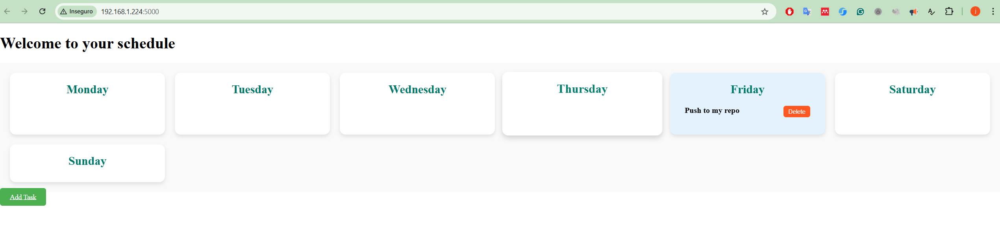
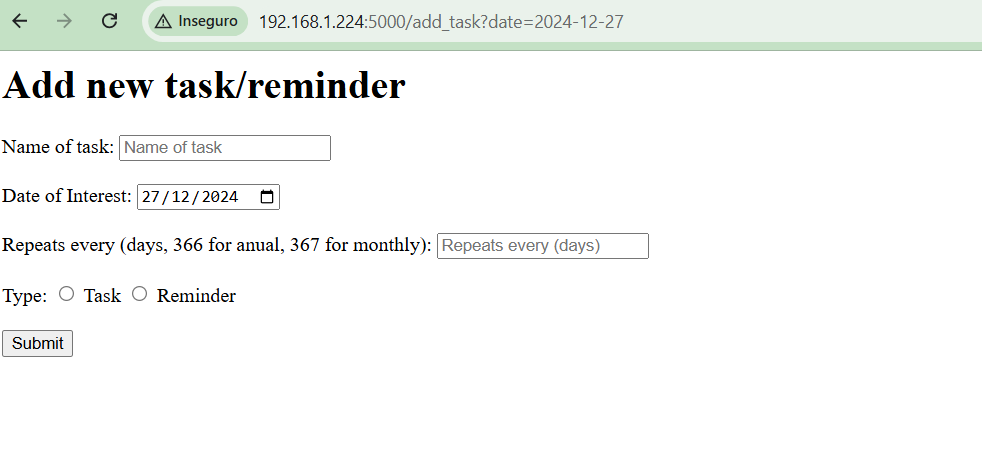

This is a simple calendar using flask web framework. 
The idea was to run this 24/7 on my raspberry pi and be able to see my household weekly tasks and appointments.

```
python3 app.py
```
The calendar should look like this:


And adding a task:
